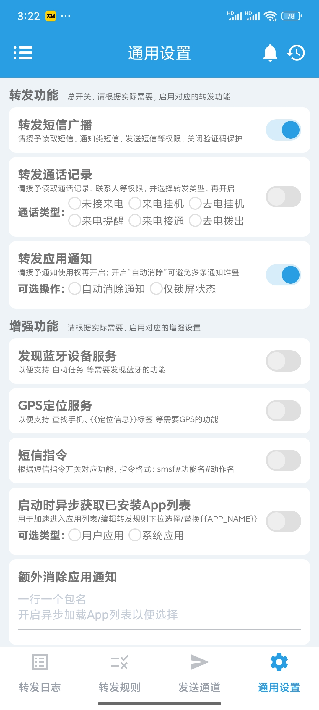
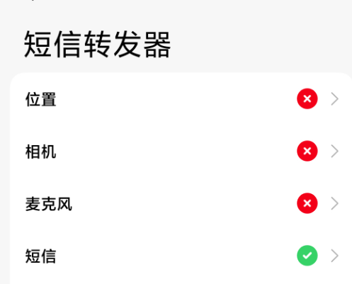

<div align="center">

</div>

---

<div align="center">
<h1>:sparkling_heart: SMSReceiver :sparkling_heart:</h1>
</div>

### 简介

目前国内很多网站登录都需要使用手机号登录，这往往需要你接收一个验证码，但是在使用电脑的时候，很多时候都懒得去打开手机看验证码。

经过一番寻找发现了这个项目 [SMSForwarder](https://github.com/pppscn/SmsForwarder) ，它可以将手机上的通知转发到其他客户端，遗憾的是并没有 Windows 客户端，所以决定自己写一个。

所以这个项目就是简单的 Windows 下的 SMSForwarder 客户端实现，可以接收 SMSForwarder 发送的通知。


### 使用教程

#### 使用Python脚本

1. 克隆仓库到本地

```bash
git clone https://github.com/nekox41/SMSReceiver.git
```

2. 安装依赖

```bash
pip install -r requirements.txt
```

3. 运行脚本

```bash
python main.py
```

4. 手机端安装 SMSForwarder 后开始设置。

打开转发短信广播的开关。



添加转发通道。

默认监听的地址是`http://0.0.0.0:8080`，所以这里填写电脑的IP地址，端口为`8080`。

消息模板填写：

```text
{"text": "[msg]"}
```

然后可以点击测试，查看能不能正常连接。


最后则是添加转发规则，通道选择刚刚新建的，选择想匹配的卡槽或者内容最后保存。


另外会有一些常见问题，例如无法转发验证码短信之类的，请查看[常见问题]("https://github.com/pppscn/SmsForwarder/wiki/%E3%80%90%E5%BF%85%E8%AF%BB%E3%80%91%E5%B8%B8%E8%A7%81%E9%97%AE%E9%A2%98")

对于使用澎湃OS的手机，请给予下面的权限：




#### 使用打包好的exe文件

下载 Release 下的 exe 文件运行，手机端设置和上方保持一致。

### 踩坑记录

1. `pyinstaller`打包后无法显示通知，原因是`pyinstaller`无法正确寻找`win10toast`依赖。

> 在`..\Lib\site-packages\PyInstaller\hooks`中新建`hook-win10toast.py`文件，写入以下内容：
> from PyInstaller.utils.hooks import copy_metadata
> datas = copy_metadata('win10toast')

2. `pyinstaller`打包后无法返回正确的网络响应，原因是打包为无控制台的文件后，无法使用标准输入输出流。

> - 使用控制台模式打包。
> - 将代码中的`send_response`方法替换为`send_response_only`方法。